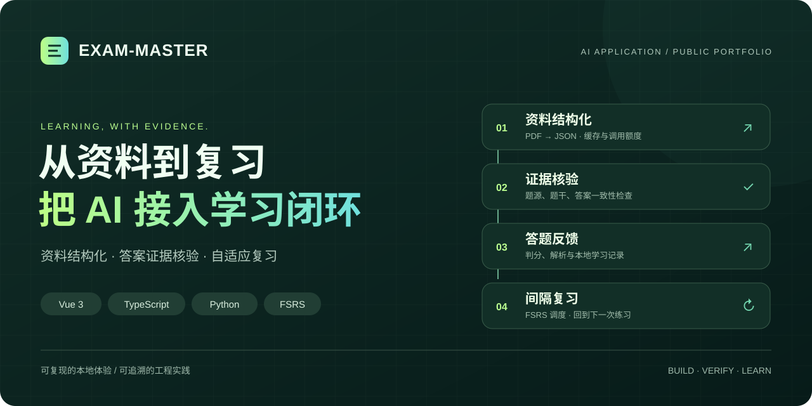
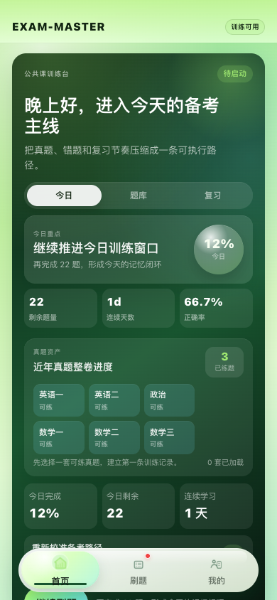
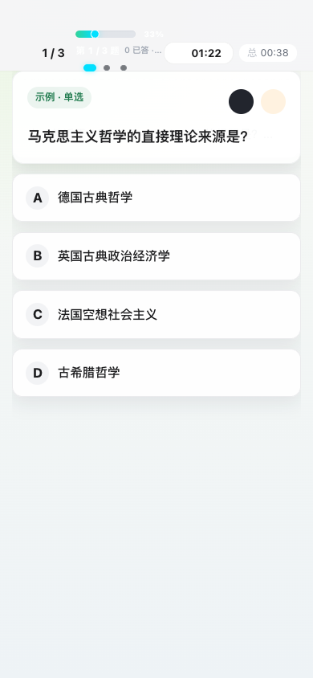
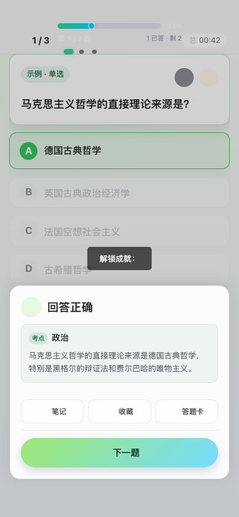
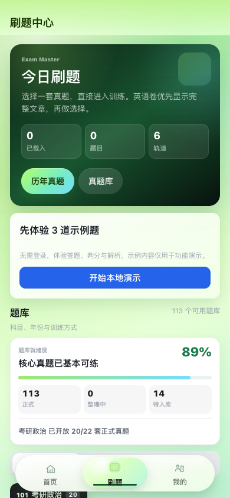
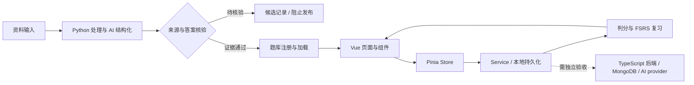

<div align="center">
  

# EXAM-MASTER · 考研大师

**将资料结构化、答案核验与间隔复习串起来的 AI 学习应用。**

An AI-assisted study workflow with evidence checks and spaced repetition.

[](https://github.com/djblack1209-coder/EXAM-MASTER/actions/workflows/ci-cd.yml)
[](https://vuejs.org/)
[](laf-backend/functions/)
[](src/services/fsrs-service.js)

[界面预览](#界面预览) · [本地体验](#本地体验) · [AI 工程实践](#ai-工程实践) · [项目状态](#项目状态) · [文档导航](#文档导航)

</div>

## 为什么做这个项目

备考资料通常散落在 PDF、题库和笔记里。EXAM-MASTER 围绕「选题 → 答题 → 判分 → 复习」组织学习过程，并探索如何把 AI 加工结果变成**有结构、能核验、可持续复习**的学习内容。

项目同时包含 Vue 3 / uni-app 客户端、TypeScript 后端模块和 Python 资料处理管线。值得讨论的工程问题包括：模型输出如何校验、答案如何追溯、调用如何控制、离线记录如何支撑复习，以及一个构建成功的应用为什么仍可能不能发布。

> **当前是公开作品展示。** 本地示例可体验答题与解析；完整题库发布、真实后端与微信实机分别验收。示例题不属于正式真题，页面中的本地学习建议不等同于模型推理。许可状态见[使用与素材边界](#使用与素材边界)。

## 界面预览

以下为本地 H5 实际运行截图，使用示例题与本地记录，无真实用户数据。建议用手机宽度查看 H5。

<table>
  <tr>
    <td align="center"><strong>学习首页</strong></td>
    <td align="center"><strong>答题过程</strong></td>
    <td align="center"><strong>判分与解析</strong></td>
  </tr>
  <tr>
    <td width="33%"></td>
    <td width="33%"></td>
    <td width="33%"></td>
  </tr>
</table>

## 本地体验

环境以 [package.json](package.json) 和锁文件为准：**Node.js ≥ 20.19.0、npm ≥ 10.8.2**。仓库的 `.npmrc` 已包含当前 DCloud 依赖所需的安装选项。

```bash
git clone https://github.com/djblack1209-coder/EXAM-MASTER.git
cd EXAM-MASTER
npm ci
# 首次配置：复制 .env.example 为 .env.local；已有配置时请勿覆盖。
npm run dev:h5
```

1. 打开终端输出的本地地址，进入底部「刷题」。
2. 尚未加载题库时，点击 **开始本地演示**，体验 3 道示例题。
3. 选择答案查看判分、解析；完成后查看本次正确率与分类统计。

本地示例无需账号或 AI key。已有题库时隐藏示例入口，避免替换当前练习内容；需要从空状态体验时可用独立浏览器配置或无痕窗口。开发模式提供演示，正常生产构建关闭示例入口。

<details>
<summary><strong>需要后端或微信环境时</strong></summary>

- 云端登录、同步和在线 AI 需要独立配置服务端。参考[后端运行与部署](docs/09A-LAF-BACKEND-DEPLOYMENT.md)，它们不在本地示例验收范围内。
- `.env.example` 仅包含前端公开配置。AI key、JWT 签名材料、数据库凭据和微信 AppSecret 不得使用 `VITE_` 前缀。
- `npm run dev:mp-weixin` 用于微信开发；构建产物与真实设备仍需各自验证。
- 正常 H5 构建使用 `npm run build:h5`，同时复制 CDN 资源到产物。H5 可打开不能证明微信登录、隐私授权和分包加载正常。

</details>

<details>
<summary>查看本地演示入口</summary>



</details>

## AI 工程实践

| 工程问题 | 项目中的实现 | 代码 / 验证入口 |
| --- | --- | --- |
| 如何把长资料变成结构化题目？ | PDF 文本处理、分批生成、JSON 解析、缓存与调用额度限制 | [PDF → flashcard 管线](scripts/pipeline/pdf2flashcard-v2.py) · [管线测试](tests/unit/test_pdf2flashcard_v2.py) |
| 如何处理看似合理却未经核验的答案？ | 题源和文本哈希关联；候选答案不直接晋级可发布状态 | [答案证据修复](scripts/baidu/answer_evidence_repair.py) · [质量检查](scripts/baidu/flashcard_quality.py) |
| 如何管理模型供应商？ | 统一 provider 接口、供应商配置、响应校验与故障切换逻辑 | [provider 工厂](laf-backend/functions/_shared/ai-providers/provider-factory.ts) · [隔离测试](tests/unit/ai-provider-pool.spec.js) |
| 后端如何保护答题写入？ | 身份校验、限流、参数校验与重复提交处理 | [answer-submit](laf-backend/functions/answer-submit.ts) · [幂等测试](tests/unit/audit-answer-submit-idempotency.spec.js) |
| 没有云服务时如何继续学习？ | 本地答题记录、错题聚类、学习计划与会话进度 | [学习引擎 Store](src/stores/modules/study-engine.js) · [本地行为测试](tests/unit/offline-business-closure.spec.js) |
| 如何安排下一次复习？ | 基于 `ts-fsrs` 的卡片状态、到期筛选与持久化 | [FSRS service](src/services/fsrs-service.js) |

**实现边界：** provider 工厂与其隔离测试不等同于在线 AI 已可用。当前仓库的 `proxy-ai` / `proxy-ai-stream` 只有 YAML 元数据，缺少对应 TS/JS 入口；完整在线 AI 路径仍需补齐并验证。管线缓存、额度控制也需要真实任务的费用与质量评测，不能据此宣称低成本或高准确率。



## 项目状态

| 范围 | 当前说明 |
| --- | --- |
| 本地 H5 演示 | 示例选题、答题、判分、解析与报告可本地体验；不使用正式题库替代品解除门禁 |
| 题库质量 | 2026-09-13 本地报告：`canPublish=false`，14 个覆盖缺口、7 个来源证据缺口 |
| 在线 AI | provider 模块可审阅和隔离测试；代理入口源码缺失，真实调用与故障恢复待验证 |
| 生产数据与后端 | 尚未重新验收；既有生产记录中的 MongoDB 恢复阻塞仍需用真实业务复核 |
| 微信小程序 | 保持 2 MB 主包预算；本地构建、隐私/分包检查和微信实机验收分别成立 |

生产发布入口拒绝未保护写入。`bash deploy/tencent/scripts/deploy-h5.sh --build-only` 只构建本地候选；生产恢复需要真实数据源、可恢复备份、前态匹配、原子应用、独立回滚及真实业务后检。详见[部署边界](docs/09-DEPLOYMENT-GUIDE.md)。

## 验证与复现

CI 徽章链接到真实运行结果；测试数量随代码变化，不在首页维护手写「全绿」成绩。

```bash
# AI 工厂、演示边界与本地学习行为（无需供应商凭据）
npm test -- tests/unit/ai-provider-pool.spec.js tests/unit/guest-demo-boundary.spec.js tests/unit/offline-business-closure.spec.js

# 客户端验证
npm run lint
npm test
npm run build:h5
npm run build:mp-weixin

# 内容质量报告；报告命令本身成功不代表允许发布
npm run audit:question-bank:report
```

完整公开发布使用现有 `npm run release:gate` 及必要的外部/设备验收。当前有真实阻塞，不能通过样例数据或降低门禁绕过。更多验证方式见[测试文档](docs/08-TESTING-INFRA.md)。

## 接下来完善什么

- [x] 无账号本地示例、真实截图与代码导览。
- [x] 明确区分本地学习建议与在线 AI 能力。
- [ ] 补齐 AI 代理入口，完成「请求 → provider → 响应 → 页面」的真实调用与失败恢复验收。
- [ ] 建立固定评测集：结构化成功率、答案一致性、人工复核耗时、每题调用成本。
- [ ] 补足题源和答案证据，完成数据库恢复与微信实机路径。
- [ ] 在许可与内容范围明确后，再评估贡献机制和独立公开 Demo。

## 文档导航

| 想了解什么 | 从这里开始 |
| --- | --- |
| 用 3 分钟讲清项目、设计取舍与后续方向 | [产品定位与项目讲解](docs/01-PRODUCT-VISION.md) |
| 系统边界和模块依赖 | [架构](docs/02-ARCHITECTURE.md) · [模块索引](docs/03-MODULE-INDEX.md) |
| 客户端入口与交互 | [前端参考](docs/06-FRONTEND-REFERENCE.md) |
| 如何验证、如何发布 | [测试](docs/08-TESTING-INFRA.md) · [部署](docs/09-DEPLOYMENT-GUIDE.md) |
| 完整资料与本轮改进 | [文档索引](docs/00-INDEX.md) · [变更日志](docs/12-CHANGELOG.md) |

## 使用与素材边界

本仓库目前用于**公开作品展示与技术交流，暂未授予开源许可证**，根包标记为 `UNLICENSED`。第三方依赖保留各自许可证；题库、原始 PDF 和第三方图片不能因为仓库公开就视为可自由使用，相关授权范围需要单独确认。

## 交流

欢迎通过 [Issues](https://github.com/djblack1209-coder/EXAM-MASTER/issues) 反馈可复现问题，或讨论 AI 学习应用的工程取舍。请勿上传个人资料、密钥或未经授权的完整题库。

如果这个项目的实践对你有帮助，欢迎点一个 **Star**，也欢迎指出值得改进的地方。
